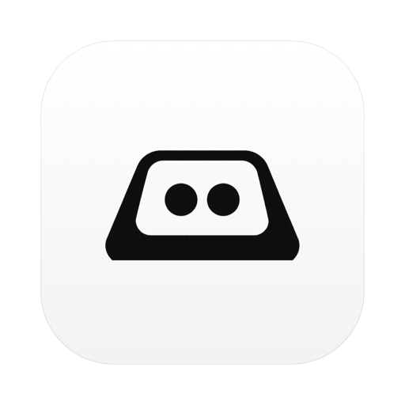

<div align="center">



# Clack

**A quiet keystroke counter for the macOS menu bar.**

Counts how many keys you press. Nothing else.

[Download](https://github.com/ay-chang/clack/releases/latest) ·
[Privacy](PRIVACY.md) ·
[Performance](#performance) ·
[Build from source](#build-from-source)

</div>

---

## What it is

Clack puts a small mark in your menu bar and counts every key you press. Click it
for today's total, a seven-day chart, your best day, your streak, and your
all-time count.

It is deliberately small. No goals, no leaderboards, no accounts, no cloud, no
notifications, nothing to defend. A number that goes up, and nothing you're
supposed to do about it.

The menu bar shows only the icon by default — a live number ticking away in your
peripheral vision is a distraction, and the whole point is that this thing stays
quiet. If you want the count up there, it's a toggle in Settings.

## Install

**Homebrew:**

```bash
brew install --cask ay-chang/tap/clack
```

**Direct download:** grab the `.dmg` from
[the latest release](https://github.com/ay-chang/clack/releases/latest), drag
Clack to Applications, and open it.

Requires macOS 14 or later. Universal — Apple Silicon and Intel.

On first launch Clack asks for **Accessibility** access. macOS treats reading
keyboard events as privileged, and offers no narrower "count but don't read"
permission, so every app of this kind needs it.
[Exactly what Clack does and doesn't record →](PRIVACY.md)

## Privacy in one paragraph

Clack stores **one integer per day** and nothing else. It never reads which key
you pressed, never sees what you typed, never records which app you were in, and
makes **no network connections** of any kind. Password fields are invisible to it
— macOS secure input cuts off every event tap, Clack included. The full
accounting, with the lines of source to check, is in [PRIVACY.md](PRIVACY.md).

## Performance

Counting keystrokes badly is an easy way to make a Mac feel slow. Here is what
Clack actually costs, measured rather than asserted.

### Measured

On an M-series Mac, panel closed, over a 60-second window:

| | |
|---|---|
| CPU | 0.03s per 60s — about **0.05%** |
| **Idle wakeups** | **0.00 per second** |
| Memory | **15 MB** (rises to ~55 MB while the panel is open) |
| Leaks | 0 |
| Network | none — there is no networking code in the binary |
| Disk | one ~40-byte write per minute |

And while actively typing, measured across 253 real keystrokes:

| | |
|---|---|
| CPU | 0.12s per 75s — about **0.16%** |
| Visible in the CPU trace? | **No.** The typing burst is indistinguishable from idle. |

### Why battery is fine: wakeups, not CPU

The number that matters for battery is not CPU percentage, it is **idle
wakeups** — how often a process drags the CPU out of its low-power state on its
own schedule. A modern Mac spends most of its life racing back to idle, and an
app that interrupts that costs far more energy than the work it does once awake.
This is what macOS's own "Energy Impact" column is mostly measuring.

Clack generates **zero idle wakeups per second.** Its one-second timer carries a
250ms tolerance, which lets macOS fold that tick into a wakeup it was already
going to perform instead of demanding a dedicated one. For comparison, measured
on the same machine at the same time: Spotify 1.40 wakeups/sec, Google Chrome
0.10.

The keyboard tap — the part people assume is expensive — adds **no wakeups at
all.** It runs *inside* the wakeup the system was already performing to deliver
your keystroke to whatever app you're typing into. It rides along, does one
integer increment, and returns. It cannot wake your Mac, because it only ever
runs when something else already did.

### How it stays that cheap

Four choices, in the order they matter:

**The tap runs on its own thread.** A `CGEventTap` sits synchronously inside the
system's event-delivery path. If its callback runs on the main thread and that
thread ever stalls — a SwiftUI re-render, a disk write — macOS times the tap out
and *disables it*, and you feel the latency. Clack's tap runs on a dedicated
`userInteractive` thread parked on its own run loop, and re-arms itself if the
system disables it anyway.

**The callback does exactly one thing.** It checks an auto-repeat flag,
increments an integer behind an uncontended `os_unfair_lock` (~20ns), and
returns. No allocation, no logging, no I/O, no UI work. At human typing speed
that is about ten lock acquisitions per second.

**Everything else is coalesced.** The UI reads the counter once per second, never
once per keystroke. Disk writes are batched to once a minute, plus on sleep and
on quit. Nothing is recomputed that didn't change: folding a keystroke into the
day's total is an integer add, not a rescan of history.

**The menu bar doesn't re-render while you type.** This is the one that bites
naive implementations. Redrawing a status item makes AppKit rasterise the view
and relayout the entire menu bar; doing that at typing speed is 10 relayouts a
second. Clack's status item observes only its own display string, and by default
that string is just the icon — so while you type, it renders nothing at all.

The tap is created `listenOnly`, so the system discards whatever the callback
returns. Clack is structurally incapable of modifying, blocking, or injecting a
keystroke.

### Reproduce it yourself

```bash
PID=$(pgrep -x Clack)

# CPU over 60s
T1=$(ps -o time= -p $PID); top -l 2 -s 60 -pid $PID >/dev/null; ps -o time= -p $PID; echo "was $T1"

# Idle wakeups, memory, leaks
top -l 2 -s 30 -pid $PID -stats pid,cpu,idlew,mem
vmmap --summary $PID | grep "Physical footprint:"
leaks $PID | tail -2
```

## Build from source

```bash
git clone https://github.com/ay-chang/clack
cd clack
make run
```

That produces a universal, ad-hoc-signed `build/Clack.app` and launches it.

Accessibility permission is bound to the code signature, not the path — so an
ad-hoc build gets a new signature on every rebuild and must be re-authorised each
time: remove the stale entry in System Settings with the `−` button, then grant
the new build. With a Developer ID certificate the grant survives rebuilds:

```bash
make SIGN_IDENTITY="Developer ID Application: Your Name (TEAMID)" run
```

Symptom of a stale grant: Clack appears switched **on** in System Settings ›
Privacy & Security › Accessibility, but the app still says "Accessibility access
needed" and counts nothing. Remove the entry and re-grant.

| Command | |
|---|---|
| `make` | build `build/Clack.app` |
| `make run` | build and launch |
| `make dmg` | build a distributable disk image |
| `make icon` | regenerate the icon and menu bar image from `Resources/clack-mark.png` |
| `swift test` | run the test suite |
| `make open-support` | reveal the stored history file |

## Project layout

```
Sources/Clack/
  EventTap.swift     the privileged part — read this one first
  Counter.swift      the lock-protected tally
  Store.swift        one integer per day, batched to disk
  AppModel.swift     the once-per-second tick that drives everything
  PanelView.swift    the menu bar panel
  WeekChart.swift    the seven-day chart
Scripts/make-icon.swift   builds the .icns and menu bar image from the source mark
```

## License

MIT. See [LICENSE](LICENSE).
